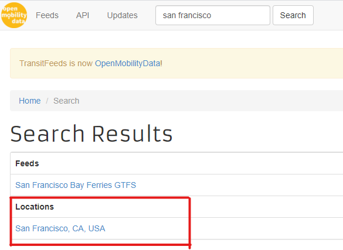
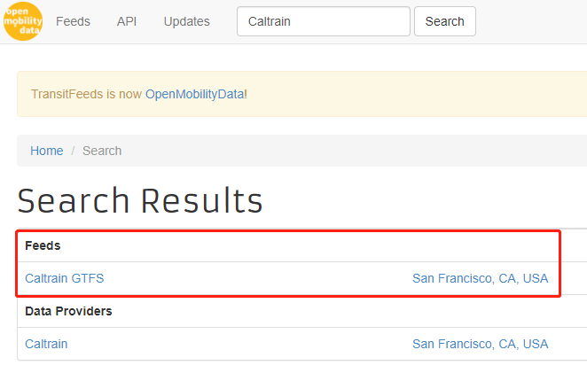

# *Get Feeds* Instructions

*<p style="text-align: center;"> The following instructions are for ```Get Feeds.py```</p>*
*<p style="text-align: center;"> The script works for [Python 3](https://www.python.org/downloads/) and is used for **[General Transit Feed Specification (GTFS)](https://gtfs.org/)** data scraping </p>*
    
###### <p style="text-align: right;"> Mengying Ju </p>
###### <p style="text-align: right;"> May 29, 2020 </p>

## Introduction

> Public transit agencies publish data on GTFS feeds. This general format allows various applications to get access to and conduct analysis on it.
>
> Information is stored separately in ```.txt``` files (agency.txt, stops.txt, routes.txt...), so it is not easy when we need to find information for a specific aspect.
>
> This script can search for feeds in your **interest area** among your **interest carriers** during your **interest study period**.
>
> Furthermore, the script will search for schedules from multiple tables.


This script can - 
* Automatically download the feeds that cover the study period, from [GTFS feeds](http://transitfeeds.com/).
* Extract the zip files into folders, and delete themselves.
* Join the tables into a single one, while only keeping the schedule information that we care about.
* Save joined tables into ```.csv``` (and delete the raw files if needed).

 
## Attentions 
1. There is no data file needed, so you can put the ```.py``` file in the folder where you want to get the feeds downloaded.
2. Make sure that you have a [GTFS API](http://transitfeeds.com/api/). Once you have your API, please replace *[line 17](https://github.com/jmysnow/GTFS-Feeds/blob/02a5cef79f3668628ec39d034646ed2cd92af0e2/Get%20Feeds.py#L17)* with your own API key.
3. Make sure you know your **interest area**, **interest carriers** and **interest study period**.
4. Make sure your have packages to be imported in this script installed ([pandas](https://pypi.org/project/pandas/), [requests](https://pypi.org/project/requests/), os, shutil, datetime, zipfile). Below is a brief introduction of how the important packages work.
    * **os**: To deal with files, directories and to conduct operations that interact with the operating system.
    * **requests**: To make API requests and to download files from a given url.
    * **shutil**: To move files from one directory to another.
    * **zipfile**: To unzip files.

5. Set the ```city``` in *[line 16](https://github.com/jmysnow/GTFS-Feeds/blob/02a5cef79f3668628ec39d034646ed2cd92af0e2/Get%20Feeds.py#L16)*, ```apikey``` in *[line 17](https://github.com/jmysnow/GTFS-Feeds/blob/02a5cef79f3668628ec39d034646ed2cd92af0e2/Get%20Feeds.py#L17)*, ```carriers``` in *[line 18](https://github.com/jmysnow/GTFS-Feeds/blob/02a5cef79f3668628ec39d034646ed2cd92af0e2/Get%20Feeds.py#L18)*, ```start``` in *[line 22](https://github.com/jmysnow/GTFS-Feeds/blob/02a5cef79f3668628ec39d034646ed2cd92af0e2/Get%20Feeds.py#L22)* and ```end``` in *[line 23](https://github.com/jmysnow/GTFS-Feeds/blob/02a5cef79f3668628ec39d034646ed2cd92af0e2/Get%20Feeds.py#L23)*.
    * **city**: The city that you want to find transit information from. Check if the city name is in the list by browsing to [OpenMobilityData](https://transitfeeds.com/). Type in the name in the search box and see if it exists in **Locations** tab. See example below when ```city = "San Francisco"```.
    
        
    * **apikey**: Your OpenMobilityData API. Obtain it [here](https://transitfeeds.com/api/) using your [GitHub](https://github.com/) account.
    * **carriers**: A list of transit agencies that you are interested in. Check if the agency name is in the list by browsing to [OpenMobilityData](https://transitfeeds.com/). Type in the name in the search box and see if ```name + ' GTFS'``` exists in your **interest city**, under **Feeds** tab. See example below when one of the ```carriers``` is ```"Caltrain"```.
        
        
    * **start**: The start date of your interest study period, formatted in ```datetime```, and you only need to specify the ```year```, ```month``` and ```day```.
    * **end**: The end date of your interest study period, formatted in ```datetime```, and you only need to specify the ```year```, ```month``` and ```day```.
    
6.  Do not open ```Feeds``` folder when the script is still running. When the folder is occupied, the program may error because of permission issues. 
7. If everything goes as expected, it will generate a folder called ```Feeds```, with all joined tables (and all raw data if not deleted) inside.


## Classes and functionalities
There is **a single class** and **three separate functions** included in this script.
### GTFSapi Class
This class is mainly created for GTFS API search.

1. **full_url(self)**: It is a ```@property``` function that is used to generate the full url for API search given a base url and a bunch of corresponding parameters.
2. **get_request(self)**: Makes API search using current ```full_url```.
3. **get_locations(self)**: Gets a list of locations.
4. **get_feeds(self, city_name, descendants = 1, page = 1, limit = 100, _type = 'gtfs', carrier = [])**: Gets the feeds of a given ```city``` with given ```carriers```. It relies on ```get_locations()``` which provides location IDs for cities.
5. **get_feed_versions(self, feed_id, page = 1, limit = 100, err = 0, warn = 0)**: Gets the feeds with a specific version ID. The version ID can be found from ```get_feeds()```.
6. **get_all_versions(self, feed_ids)**: Gets the feeds with a list of feed version ids. If total number of results exceeds the page limit, iteratively make requests until no results can be found.


### Functions
1. **filter_period(versions, start, end)**: Filters out the feeds within a specific study period, which is specified by ```start``` and ```end```.
2. **remove_all(_dir)**: Helps delete all files within a given directory. If there is any clustered subdirectory, recursively remove it until there's nothing left.
3. **download_join_feeds(feeds)**: 
    * Download the feeds within the study period, and save the zip files to disk, with the IDs as filenames.
    * Unzip the zip files, and delete the original zip files.
    * Within each subdirectory, merge the ```calendar.txt```, ```trips.txt```, ```stop_times.txt``` and ```stops.txt```, and save the joined tables as ```.csv``` files.
    * Delete the raw data folders if needed.


## Steps to follow

After making the changes stated in *Attentions*, simply run the whole file. The ```Feeds``` folder will show up with files after 2 min.
