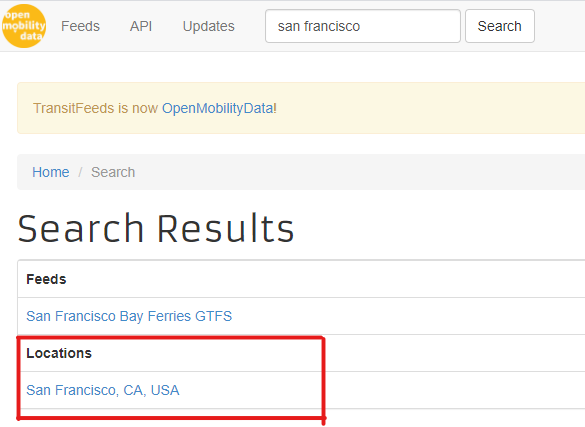

# *Get Feeds* Instructions

*<p style="text-align: center;"> The following instructions are for ```Get Feeds.py```</p>*
*<p style="text-align: center;"> The script works for [Python 3](https://www.python.org/downloads/) and is used for **[General Transit Feed Specification (GTFS)](https://gtfs.org/)** data scraping </p>*
    
###### <p style="text-align: right;"> Mengying Ju </p>
###### <p style="text-align: right;"> May 29, 2020 </p>

## Introduction

> Public transit agencies publish data on GTFS feeds. This general format allows various applications to get access to and conduct analysis on it.
>
> Information is stored separately in ```.txt``` files (agency.txt, stops.txt, routes.txt...), so it is not easy when we need to find information for a specific aspect.
>
> This script can search for feeds in your **interest area** among your **interest carriers** during your **interest study period**.
>
> Furthermore, the script will search for schedules from multiple tables.


This script can - 
* Automatically download the feeds that cover the study period, from [GTFS feeds](http://transitfeeds.com/).
* Extract the zip files into folders, and delete themselves.
* Join the tables into a single one, while only keeping the schedule information that we care about.
* Save joined tables into ```.csv``` (and delete the raw files if needed).

 
## Attentions 
1. There is no data file needed, so you can put the ```.py``` file in the folder where you want to get the feeds downloaded.
2. Make sure that you have a [GTFS API](http://transitfeeds.com/api/). Once you have your API, please replace *line 17* with your own API key.
3. Make sure you know your **interest area**, **interest carriers** and **interest study period**.
4. Make sure your have packages to be imported in this script installed ([pandas](https://pypi.org/project/pandas/), [requests](https://pypi.org/project/requests/), os, shutil, datetime, zipfile). Below is a brief introduction of how the important packages work.
    * **os**: To deal with files, directories and to conduct operations that interact with the operating system.
    * **requests**: To make API requests and to download files from a given url.
    * **shutil**: To move files from one directory to another.
    * **zipfile**: To unzip files.

5. Set the ```city``` in *line 16*, ```apikey``` in *line 17*, ```carriers``` in *line 18*, ```start``` in *line 22* and ```end``` in *line 23*.
    * **city**: The city that you want to find transit information from. Check if the city name is in the list by browsing to [OpenMobilityData](https://transitfeeds.com/). Type in the name in the search box and see if it exists in **Locations** tab.




## Classes and functionalities
The script includes two classes.
**Preprocessing class** relies on the configuration of **GoogleLocation class** for API searches.

1. **GoogleLocation class** takes an API key, and initializes a search instance:
    * **search_timezone(self, lat, lon, timestamp)** takes a GPS location and a timestamp, and returns the timezone the GPS spot falls in.
    * **search_city(self, lat, lon)** takes a GPS location, and returns the city and the country name that the GPS spot falls in.
2. **Preprocessing class** takes a file name and an API key, and initializes an instance that does all the preprocessing work:
    * **add_header(self)**: The given data file comes without header line, so we need to run this method to append the first line into the whole dataset. If the data comes with its own header, then no need to do so.
    * **add_city(self)**: It adds the city and country information, via API search, assuming all records for a given operator come from the same city.
    * **add_timezone(self)**: It adds the time zone information.
    * **add_provider(self, new_providers = [])**:It generalize the operators into providers. For example, all operator names containing “lyft” as provider Lyft.
    * **split_operator(self)**: Split the data by operator and save them all.
    * **split_city(self)**: Split the data by city and save them all.

## Steps to follow

After making the changes stated in *Attentions*, simply run the whole file. The disaggregated files will show up when they’re done.
